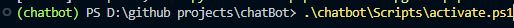

# Simple Chatbot using llama3

## Description

An in-depth paragraph about your project and overview of use.

## Getting Started

### Dependencies

* Describe any prerequisites, libraries, OS version, etc., needed before installing program.
* Windows 10
* Ollama3 - https://ollama.com/download
* Python

### Installing
* After downloading Ollama3
(In File, in Console:)
* python -m venv chatbot
* .\chatbot\Scripts\activate.ps1 

   (Note terminal should show AI environment)
* pip install -r requirements.txt
### Executing program
(In File)
    (See picture above)
* Ensure you are in AI environment
* Enter: streamlit run main.py

## Authors

Contributors names and contact info
* Christian Williams
* Christian Hernandez
